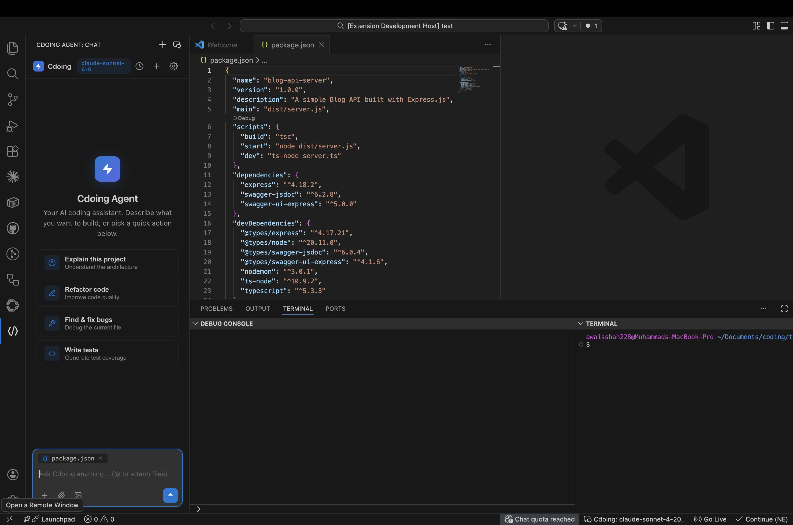
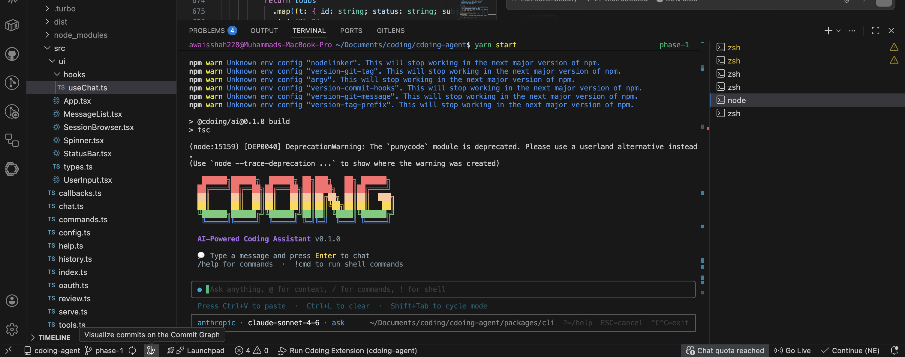

# Cdoing Agent

> Built by [@awaisshah228](https://github.com/awaisshah228)

AI-powered coding assistant — **CLI + VS Code Extension**. Multi-provider (Anthropic, OpenAI, Google), agentic tool use, real-time streaming, permission-controlled sandboxing, and full codebase awareness.





---

## What It Does

An intelligent coding agent that reads, writes, searches, and runs commands in your codebase — controlled through natural language. Think Claude Code, but open source and multi-provider.

**CLI** — terminal-based interactive chat with streaming, slash commands, conversation history, message queuing, plan mode, effort control, context providers (@terminal, @tree, @url, @codebase), and auto-complete.

**VS Code Extension** — sidebar chat panel, editor panel (beside code), multi-tab conversations, inline edit (Cmd+I), inline autocomplete (Tab completion), clickable file paths, inline diff preview, image support, syntax-highlighted code blocks with copy button.

---

## Quick Start

```bash
# 1. Clone and install
git clone <repo-url>
cd cdoing-agent
yarn install

# 2. Build all packages
yarn build

# 3. Run the CLI — it will guide you through setup on first run
yarn start
```

On first run with no API key configured, the CLI launches an interactive setup wizard (or run `/setup` at any time to reconfigure).

---

## Comparison with Continue.dev

### Tools

| Area | Cdoing Agent (17 tools) | Continue (19 tools) | Status |
|---|---|---|---|
| File read | `file_read` (full file + offset/limit + images + PDFs) | `read_file` + `read_file_range` | ✅ Complete |
| File write | `file_write` (create/overwrite) | `create_new_file` | ✅ Complete |
| File edit | `file_edit` (multi-strategy match: exact → trimmed → case-insensitive → whitespace-ignored) | `single_find_and_replace` | ✅ Enhanced |
| Multi edit | `multi_edit` (atomic batch edits) | `multi_edit` | ✅ Complete |
| File delete | `file_delete` (permission-controlled, safe deletion) | *(via shell)* | ✅ We have extra |
| Glob search | `glob_search` (.gitignore aware) | `file_glob_search` | ✅ Complete |
| Grep search | `grep_search` (regex, .gitignore aware) | `grep_search` (ripgrep + trigrams) | ✅ Complete |
| Shell exec | `shell_exec` (path permission checks, destructive detection) | `run_terminal_command` (+ background mode) | ⚠️ Missing: background mode |
| File run | `file_run` (auto-detect 14 languages) | — | ✅ We have extra |
| Code verify | `code_verify` (syntax/type check) | — | ✅ We have extra |
| Web fetch | `web_fetch` (HTML → text, JSON) | `fetch_url_content` | ✅ Complete |
| Web search | `web_search` (DuckDuckGo) | `search_web` | ✅ Complete |
| Sub-agent | `sub_agent` (parallel research) | — | ✅ We have extra |
| Todo | `todo` (task tracking) | — | ✅ We have extra |
| System info | `system_info` (live permission/sandbox state) | — | ✅ We have extra |
| **Missing** | — | `ls` (directory listing) | 🔴 To implement |
| **Missing** | — | `view_diff` (git diff) | 🔴 To implement |
| **Missing** | — | `view_repo_map` (structural overview) | 🔴 To implement |
| **Missing** | — | `codebase` (semantic RAG search) | 🔴 Major gap |

### Permission & Security

| Feature | Cdoing Agent | Continue |
|---|---|---|
| Permission modes | 5 modes (default, acceptEdits, plan, dontAsk, bypass) | Tool policies (allow, deny, allowWithPermission) |
| Settings-based rules | ✅ Allow/Ask/Deny with path/command matching | ✅ Similar |
| Sandbox (filesystem) | ✅ allowWrite/denyWrite/denyRead with path prefixes | ✅ OS-level (Seatbelt/bubblewrap) |
| Sandbox (network) | ✅ Domain allowlist + session approval | ✅ Similar |
| Shell path checking | ✅ Extracts paths from commands, checks Read/Edit/Delete rules | ❌ Not implemented |
| Delete protection | ✅ Dedicated `file_delete` tool with `Delete` permission category | ❌ Via shell only |
| System introspection | ✅ `system_info` tool — LLM queries own permissions live | ❌ Not available |

### Context Management

| Feature | Cdoing Agent | Continue | Gap |
|---|---|---|---|
| Token counting | ~4 chars/token estimate | Tiktoken (OpenAI) / Llama tokenizer | 🟡 Less accurate |
| Context pruning | Summarize old messages at 75% limit | FIFO prune from top, preserve system + last turn | ✅ Different, both work |
| Output budgeting | Dynamic per-tool char budget | Similar | ✅ Same |
| Cost tracking | Per-turn with model pricing tables | Similar | ✅ Same |
| Tool output truncation | 30k chars, preserve tail | Similar | ✅ Same |

### Context Providers

| Provider | Cdoing Agent | Continue |
|---|---|---|
| Terminal | `@terminal` ✅ | ✅ |
| Open files | `@open` ✅ | ✅ OpenFiles |
| URL | `@url` ✅ | ✅ URL |
| Tree | `@tree` ✅ | ✅ FileTree |
| Problems | `@problems` ✅ | ✅ Problems |
| Codebase | `@codebase` ✅ (text search + ranking) | ✅ (vector embeddings + RAG) |
| Clipboard | `@clipboard` ✅ | ✅ |
| File include | `@file` ✅ | ✅ File |
| **Missing** | — | Git (commit, issues, MRs) |
| **Missing** | — | Jira, Discord, Database |
| **Missing** | — | Docs (HTTP), Greptile |
| **Missing** | — | RepoMap, Folder, DiffContext |
| **Missing** | — | DebugLocals |

### Indexing & Retrieval — Major Gap

| Feature | Cdoing Agent | Continue |
|---|---|---|
| **Codebase indexing** | ❌ None | ✅ 4 index types |
| **Vector embeddings** | ❌ None | ✅ LanceDB + configurable models |
| **Full-text search** | ❌ Runtime ripgrep only | ✅ SQLite FTS5 + BM25 + trigrams |
| **Code structure** | ❌ None | ✅ Tree-sitter AST (15+ languages) |
| **Chunking** | ❌ None | ✅ Adaptive code-aware (384 tokens) |
| **RAG pipeline** | ❌ None | ✅ 2 pipelines, 4 retrieval sources |
| **Cross-branch cache** | ❌ None | ✅ Content-addressed dedup |
| **Recently edited** | ❌ None | ✅ LRU cache feeds into retrieval |

### Edit Tool Sophistication

| Feature | Cdoing Agent | Continue |
|---|---|---|
| Exact match | ✅ | ✅ |
| Trimmed match | ✅ | ✅ |
| Case-insensitive match | ✅ | ✅ |
| Whitespace-ignored match | ✅ (position mapping back to original) | ✅ |
| Fuzzy match (Jaro-Winkler) | ❌ | ✅ (disabled but implemented) |
| Multi-edit atomic batch | ✅ | ✅ |
| Reverse-order replacement | ✅ (preserves positions) | ✅ |
| Lazy apply (LLM-assisted) | ❌ | ✅ (3 strategies: deterministic, unified diff, streaming) |
| Tree-sitter AST editing | ❌ | ✅ |
| Streaming diff | ❌ | ✅ |

---

## Roadmap — What To Implement Next

### Phase 1: Missing Tools (Quick Wins)

- [ ] **`ls` tool** — list directory contents with optional recursive mode
- [ ] **`view_diff` tool** — show git diff (working changes, staged, between commits)
- [ ] **`view_repo_map` tool** — generate structural overview of the repository
- [ ] **Background shell mode** — `shell_exec` with `background: true` for servers/watchers

### Phase 2: Codebase Indexing (High Impact)

- [ ] **SQLite FTS5 index** — full-text search with BM25 ranking + trigram tokenization
  - Index on first use, incremental updates on file change
  - Path-weighted search (10x boost for filename matches)
  - Store in `~/.cdoing/index.sqlite`
- [ ] **Code chunking** — split files into meaningful chunks (384 tokens default)
  - Code-aware chunking using simple heuristic (function/class boundaries)
  - Basic chunker fallback for non-code files
  - Skip files >1MB
- [ ] **Upgrade `@codebase` provider** — use FTS index instead of runtime scan

### Phase 3: Vector Embeddings & RAG (Major Upgrade)

- [ ] **Embedding model support** — configurable (OpenAI, local models via Ollama)
- [ ] **Vector storage** — LanceDB or SQLite with vector extension
- [ ] **RAG retrieval pipeline** — combine:
  - Recently edited files (25%)
  - Full-text search (25%)
  - Vector embeddings (50%)
- [ ] **`codebase` search tool** — semantic search exposed as an LLM tool
- [ ] **Content-addressed caching** — hash file content to skip re-indexing across branches

### Phase 4: Advanced Edit Strategies

- [ ] **Jaro-Winkler fuzzy matching** — for when LLM output doesn't match exactly
- [ ] **Unified diff application** — accept `@@ -n,m +n,m @@` format patches
- [ ] **Streaming diff** — real-time diff generation as LLM streams code
- [ ] **Lazy apply** — LLM uses `// ... existing code ...` placeholders, system fills in

### Phase 5: More Context Providers

- [ ] **Git context** — `@git` for commit history, blame, branch info
- [ ] **Diff context** — `@diff` for current working changes
- [ ] **Folder context** — `@folder` for directory-scoped context
- [ ] **Docs context** — `@docs <url>` for documentation retrieval
- [ ] **Database context** — `@db` for schema/query context

### Phase 6: Accurate Token Counting

- [ ] **Tiktoken integration** — accurate token counting for OpenAI models
- [ ] **Llama tokenizer** — for Anthropic and local models
- [ ] **Image token counting** — proper estimation for multimodal inputs
- [ ] **Tool definition tokens** — count tokens used by tool schemas

---

## Authentication

### Interactive Setup Wizard

Run `/setup` inside the CLI at any time to configure provider, model, and authentication:

```
/setup
```

The wizard walks through:
1. **Provider** — Anthropic, OpenAI, Google, Ollama
2. **Auth method** (Anthropic only) — API key or OAuth
3. **Model** — filtered by auth method (OAuth supports Haiku only)
4. **API key or OAuth code** — paste key or complete browser OAuth flow

### API Key

```bash
# Environment variable (recommended for CI/scripts)
export ANTHROPIC_API_KEY=sk-ant-...

# Or save permanently
cdoing config set api-key sk-ant-...
```

### OAuth (Claude Pro/Max subscription) — [full guide](OAUTH.md)

```bash
cdoing --login        # Opens browser → paste code → done
cdoing --logout       # Clear stored OAuth tokens
```

### API Key Helper (Proxy / Dynamic Keys)

```bash
cdoing config set api-key-helper ~/.cdoing/api-key-helper.sh
cdoing config set base-url http://127.0.0.1:8045
```

### Key Resolution Order

```
1. --api-key flag (CLI argument)
2. apiKeyHelper script (from config.json)
3. Environment variable (ANTHROPIC_API_KEY, OPENAI_API_KEY, etc.)
4. Stored key in ~/.cdoing/config.json
5. OAuth token (Anthropic only — auto-refreshed if expired)
6. Interactive setup wizard
```

---

## VS Code Extension

### Setup

```bash
yarn build
code packages/vscode-extension
# Press F5 → launches Extension Development Host
```

### Features

| Action | What Happens |
|--------|-------------|
| Click `</>` icon in activity bar | Opens chat in sidebar |
| `Cmd+Shift+L` | Opens chat as editor panel beside your code |
| `Cmd+I` / `Ctrl+I` | Inline edit — select code, type instruction, see diff |
| Click 💬 on file title bar | Opens chat with file context pre-filled |
| Right-click selected code | Explain, Refactor, Fix, Inline Edit, Send to Chat |

### Multi-Tab, Image Support, Inline Autocomplete

- Multiple conversation tabs with independent state
- Attach images (PNG, JPG, GIF, WebP, SVG)
- Tab completion with configurable model

---

## Tools (17 Built-In)

### File Operations

| Tool | Description | Permission |
|------|-------------|:---:|
| `file_read` | Read file contents (text, images, PDFs). Supports offset and line limits. | No |
| `file_write` | Create new files or complete rewrites. Auto-creates parent directories. | Yes |
| `file_edit` | Multi-strategy find-and-replace (exact → trimmed → case-insensitive → whitespace-ignored). | Yes |
| `multi_edit` | Batch multiple edits to one file atomically. Sequential application, reverse-order replacement. | Yes |
| `file_delete` | Permission-controlled file/directory deletion. Configurable via `Delete` rules in settings. | Yes |

### Search & Discovery

| Tool | Description | Permission |
|------|-------------|:---:|
| `glob_search` | Find files by glob pattern (e.g., `**/*.ts`). Respects `.gitignore`. | No |
| `grep_search` | Search file contents with regex. Case-insensitive and file-filter options. | No |

### Code Execution

| Tool | Description | Permission |
|------|-------------|:---:|
| `shell_exec` | Run shell commands. Extracts paths and checks Read/Edit/Delete permissions. Flags destructive commands. | Yes |
| `file_run` | Run scripts by extension (.js, .ts, .py, .rb, .sh, .go, etc.). Timeout: 30s. | Yes |
| `code_verify` | Syntax and type checking for the current project. | No |

### Web Access

| Tool | Description | Permission |
|------|-------------|:---:|
| `web_fetch` | Fetch and extract content from URLs. Domain-restricted by sandbox. | Yes |
| `web_search` | Search the web via DuckDuckGo (no API key required). | Yes |

### Agent Control & Introspection

| Tool | Description | Permission |
|------|-------------|:---:|
| `sub_agent` | Spawn an independent sub-agent for parallel research tasks. | No |
| `todo` | Track tasks with status (pending, in_progress, completed, blocked). | No |
| `system_info` | LLM queries its own permissions, sandbox state, and available tools live. | No |

---

## Permission System

### Permission Modes

| Mode | Behavior |
|------|----------|
| `default` | Prompts before every tool that requires permission |
| `acceptEdits` | Auto-approves file writes/edits, prompts for shell commands |
| `plan` | Read-only — all write/exec/delete tools blocked |
| `dontAsk` | Deny all unless explicitly allowed in settings |
| `bypassPermissions` | Auto-approve everything (unsafe, user-opted-in) |

### Settings-Based Rules

Configure in `.claude/settings.json`:

```json
{
  "permissions": {
    "allow": ["Bash(git *)", "Bash(npm *)", "Edit(src/**)"],
    "ask": ["Bash(git push *)", "Delete"],
    "deny": ["Read(~/.ssh/**)", "Delete(.env*)", "Edit(//etc/**)"]
  }
}
```

**Rule categories:** `Bash(command)`, `Read(path)`, `Edit(path)`, `Delete(path)`, `WebFetch(domain:x)`, `Agent(name)`

**Evaluation order:** Deny → Ask → Allow (deny always wins)

**Settings precedence:** `.claude/settings.local.json` → `.claude/settings.json` → `~/.claude/settings.json`

### Shell Command Permission Checks

`shell_exec` extracts file paths from commands and checks them:

| Command type | Examples | Permission check |
|---|---|---|
| Read commands | `cat`, `less`, `head`, `tail`, `grep`, `diff`, `sort` | Read deny rules |
| Write commands | `cp`, `mv`, `chmod`, `sed -i`, `>`, `>>`, `tee` | Edit deny rules |
| Delete commands | `rm`, `rmdir`, `unlink`, `shred`, `git clean` | Delete deny rules |

### Sandbox

Enable in `.claude/settings.json`:

```json
{
  "sandbox": {
    "enabled": true,
    "mode": "auto-allow",
    "filesystem": {
      "allowWrite": ["~/Downloads", "//tmp"],
      "denyWrite": ["//etc"],
      "denyRead": ["~/.ssh", "~/.aws"]
    },
    "network": {
      "allowedDomains": ["api.github.com", "registry.npmjs.org"],
      "allowManagedDomainsOnly": false
    },
    "excludedCommands": ["docker"],
    "allowUnsandboxedCommands": false
  }
}
```

---

## Context Providers

Use `@` triggers to attach context:

| Trigger | Description |
|---------|-------------|
| `@terminal` | Last terminal command output |
| `@tree [path] [depth]` | Workspace file tree |
| `@url <url>` | Fetch and attach web page content |
| `@codebase <query>` | Search entire codebase |
| `@open` | All open editor files (VS Code only) |
| `@problems` | Current file diagnostics/errors (VS Code only) |
| `@clipboard` | Clipboard contents |
| `@file <path>` | Include specific file |

---

## Agent Architecture

```
User Message
     │
     ▼
┌──────────────────────────────────────────┐
│  Agent Runner (agentic loop)              │
│                                           │
│  Context Providers → Enrich message       │
│  Rules + Effort → System prompt           │
│                                           │
│  stream() ──► Tool Calls                  │
│    ▲          │                           │
│    │    ┌─────┴──────────────────┐        │
│    │    │ Permission Manager     │        │
│    │    │  ├─ Settings rules     │        │
│    │    │  ├─ Mode check         │        │
│    │    │  └─ User prompt        │        │
│    │    ├────────────────────────┤        │
│    │    │ Sandbox Manager        │        │
│    │    │  ├─ Filesystem checks  │        │
│    │    │  ├─ Network checks     │        │
│    │    │  └─ Shell path checks  │        │
│    │    ├────────────────────────┤        │
│    │    │ Tool Execution         │        │
│    │    │  Parallel: file_read,  │        │
│    │    │    grep, glob, web,    │        │
│    │    │    sub_agent           │        │
│    │    │  Sequential: shell,    │        │
│    │    │    file_run            │        │
│    │    │  Smart: file_edit/     │        │
│    │    │    write (parallel if  │        │
│    │    │    different files)    │        │
│    │    └─────┬──────────────────┘        │
│    │          │                           │
│    └──── Results ◄────────────────────────┘
│                                           │
│  + Retry with backoff                     │
│  + Context compression                    │
│  + Token tracking & cost                  │
│  + Pre/post hooks                         │
│  + Plan mode (read-only)                  │
└──────────────────────────────────────────┘
```

---

## Project Structure

```
cdoing-agent/
├── packages/
│   ├── core/                    # @cdoing/core — tools, permissions, sandbox, hooks
│   │   └── src/
│   │       ├── tools/           # 17 built-in tools
│   │       ├── permissions/     # Permission manager (5 modes, settings rules)
│   │       ├── sandbox/         # Filesystem & network sandboxing
│   │       ├── hooks/           # Pre/post tool execution hooks
│   │       ├── context-providers/ # 8 @ mention providers
│   │       ├── rules/           # Glob-scoped project rules
│   │       ├── plan/            # Plan mode manager
│   │       ├── mcp/             # MCP server manager
│   │       ├── effort/          # Effort level control
│   │       └── utils/           # Path safety, search matching, memory
│   ├── ai/                      # @cdoing/ai — agent runner, providers
│   │   └── src/
│   │       ├── agent-runner.ts  # Agentic loop with parallel execution
│   │       ├── provider.ts      # Multi-provider LLM support
│   │       ├── context-manager.ts # Token tracking, compression, cost
│   │       └── system-prompt.ts # System prompt with permission awareness
│   ├── cli/                     # @cdoing/cli — terminal interface
│   └── vscode-extension/        # VS Code extension (React webview)
```

---

## AI Providers

| Provider | Models | Auth |
|----------|--------|------|
| Anthropic (default) | Claude Sonnet 4.6, Opus 4.6, Haiku 4.5 | API key or OAuth |
| OpenAI | GPT-4o, GPT-4o mini, o3-mini | API key |
| Google | Gemini 2.0 Flash, 1.5 Pro, 1.5 Flash | API key |
| Ollama | LLaMA, Mistral, CodeLlama | Not required |
| Custom | Any OpenAI-compatible API | Configurable |

---

## Development

```bash
yarn install        # Install dependencies
yarn build          # Build all packages
yarn start          # Run CLI
yarn dev            # Dev mode (watch + run)
```

---

## License

MIT
